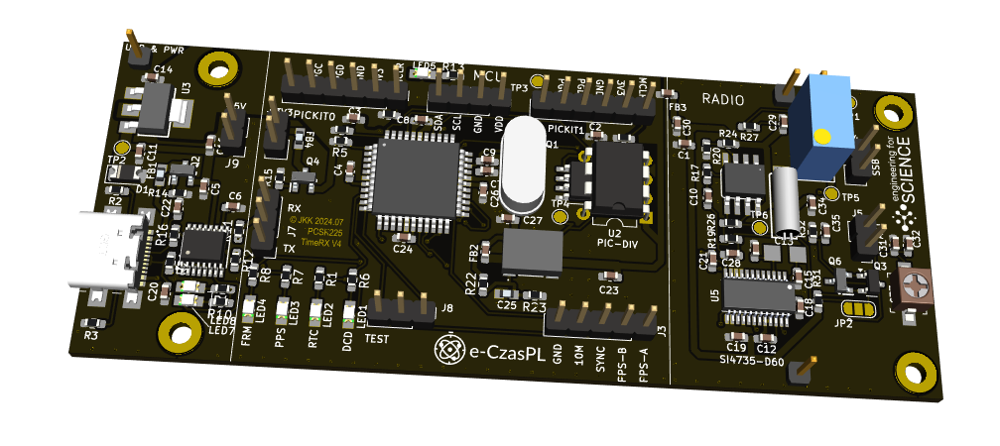
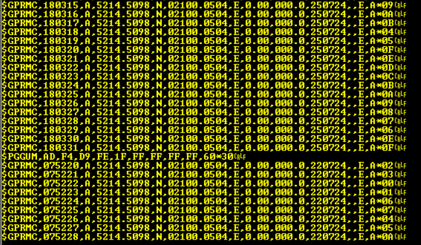
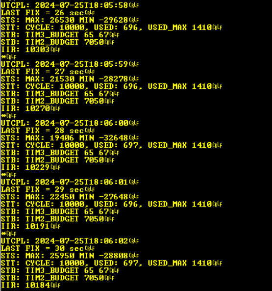

# PCSK225 RECEIVER WITH USB
## eCzas Radio PCSK-225 - Timeframe Receiver with USB

<ul>
<li>2024-07-25 - First version of the project</li>
</ul>

 Na bazie odbiornika uroszczonego z <a href="https://github.com/e-CzasPL/TimeReceiver225kHz" target="_blank">e-CzasPL Radio</a> opracowałem testowy odbiornik z wbudowanym konwerterem serial/USB oraz prostym wzmacniaczem antenowym na jednym tranzystorze. Projekt jest wykonany w KiCAD 8.

 

Odbiornik zawiera trzy podstawowe bloki
<ol>
<li>Interfejs USB na układzie FT230X + LDO 3.3V
<li>Procesor DSPic33FJ128 wraz z opcjonalnym generatorem TCXO i dzielnikiem PicDIV
<li>Interfejsem radiowym na układzie Si4735 ze wzmacniaczem antenowym na tranzystorze FET
</ol>

** UWAGA - Firmawre pochodzi z projektu eCzasPL, nie posiadam kodów źródłowych **

### Interfejs USB

Interfejs USB zbudowałem na układzie FT230XS, jednym z najprostszych układów typu serial/USB. Zastosowałem typowe złacze USB-C 2.0 do przesyłania danych i zasilania napięciem 5V.

Do zabezpieczenia układu przed odwrotną polaryzacją (a takie rzeczy się zdarzają przy eksperymentach) zastosowałem tranzystor Q2. Rezystory R2, R3 informują komputer hosta że wymagane jest napięcie 5V. stan transmisji pokazują diody LED7 i LED8.

 Układ U3 jest prostym LDO o napięciu wyjściowym 3.3V. Cały układ pobiera ok 100mA, ten stabilizator z dużym  nadmiarem zapewnia takie natężenie prądu. Złącze zewnętrznego zasilania 3.3V (gdy nie jest zamontowany USB i LDO) jest zabezpieczone tranzystorem Q4. Wejście dodatkowe zasilania 5V zabezpieczone jest tylko dioną D1.

### Procesor DSPic33FJ128

W układzie zstosowalem wskazany w projekcje eCzasPL procesor DSPIC33FJ128MC804-PT w łatwej (stosunkowo) do montażu ręcznego obudowie. Standardowo dołączyłem kondensatory blokujące 100nF na odpowiednich pinach, resystory podciągające I2C, generator kwarcowy na typowym kwarcu 10MHz. Zestaw ledów LED1 - LED4 sygnalizuje status odbiornika. Układ ma dwa interfejsy szeregowe: NMEA i TEST. 

Interfejs NMEA na pinie (1) złącza wysyła ramkę NMEA $GPRMC - co pozwoliło na stosowania do dekodowania czasu standardowych bibliotek dostępnych dla mikrokontrolerów i komputerów. Drugie wyjście TEST na pinie (3) wysyła informacje o stanie układu w postaci tekstowej. Obydwa interfejsy pracują w szybkości 115200 bodów.

Opcjonalnie można zamontować precyzyjny generator TCXO który generuje częstotliwość 10MHZ i może zasilać zegar procesora. Znacznie zwiększa to dokładność pracy. W celu uzyskania sygnału 1PPS zastosowano układ PIC12F675 (w dwóch wersjach obudowy, oczywiście nalezy zamontować tylko jeden z nich).

 UWAGA - mikrosteping i synchronizacja PICDIV nie jest jeszcze zaimplementowana w firmware eCzasPL Radio.

### Odbiornik HF

Antena ferrytowa np. z https://telzam.pl/anteny-dcf/ (wykonują także anteny na 225kHz) podłączona jest przez złącze ANT0 do tranzystora FET który pełni rolę wzmacniacza. Jest on opcjonalny i można zewrzeć odpowiednie pola JP2 aby sygnał docierał bezpośrednio do wejścia układu Si4735. Układ ten jest połaczony z kwarcem zegarkowym 32kHz, co przy użyciu patcha SSB pozwala na uzyskanie zmieszanej częstotliwości wstęgi bocznej (górnej USB) o częstotliwości 1kHz. Ten sygnał uzyskiwany z wyjścia LOUT jest wzmacniany w jednostopniowym wzmaczniaczu U$1A i sygnał zasila przetwornik ADC w procesorze. Drugi wzmacniacz układu U$1B nie jest używany.

### Sygnały wyjściowe

Na wyjściu NMEA powinny byc dane jak pokazano poniżej. Po uzyskaniu synchronizacji pojawia się co 1min. ramka $PGGUM, pierwsze 9 bajtów to kojejne bajty zakodowanej ramki czasu, ostatni to czas od ostatnio odebranej poprawnej ramki. Do synchronizacji czasu zastosowano ramkę RMC (Recommended Minimum Specific GNSS Data). Odbiornik nie zna swojego położenia geograficznego, dlatego dla zachowania kompatybilności z odbiornikami GNSS w ramce przesyłane są statyczne współrzędne <a  target=_blank>href="https://www.google.pl/maps/place/52%C2%B014'30.6%22N+21%C2%B000'03.0%22E/@52.24183,20.9982597,17z/data=!3m1!4b1!4m4!3m3!8m2!3d52.24183!4d21.00084?entry=ttu">Laboratorium Czasu i Częstotliwości Głównego Urzędu Miar w Warszawie (52.24183N, 21.00084E)</a>.

Dokładny opis zawarty jest w <a href="https://github.com/e-CzasPL/TimeReceiver225kHz/blob/main/doc/e-CzasPL-Opis-projektu-przykladowego-modulu-odbiorczego-e-Czas-Radio.pdf">dokumentacji</a>  na stronie 8.

 Na wyjściu TEST układ wysyła dane diagnostyczne. STS: MAX/MIN - maksymalny i minimalny poziom z ADC (12 bitów) - może być pomocny przy optymalizacji poziomu audio 1 kHz na wejście procesora. IIR - to "offset" - przesunięcie prążka 1kHz - od częstotliwości nominalnej, pokazuje "odstrojenie" frontendu - sterowanego tym małym kwarcem zegarkowym.  Umożliwia to nadążenie filtrem DSP za sygnałem użytecznym. 

## Sygnały
<ul>
<li>LED1 - DCD Blue - sygnalizacja rozpoznania początku ramki danych (po wykryciu słowa kluczowego) – pozostaje zapalona do końca transmisji ramki,
<li>LED2 - RTC Green - Informuje o odebraniu poprawnego czasu i wpisaniu go do RTC, w przypadku braku możliwości aktualizacji RTC z transmisji radiowej dioda jest gaszona po 24 godzinach,
<li>LED3 - PPS Yellow - 1PPS Sygnał 1PPS zsynchronizowany z odebranym sygnałem czasu,
<li>LED4 - FRM Orange - zapalana po poprawnym odebraniu ramki danych, przeliczeniu kodów korekcyjnych oraz potwierdzeniu poprawności danych. Narastające zbocze informuje o początku sekundy (przesłanej w ramce danych).
</ul>

	
